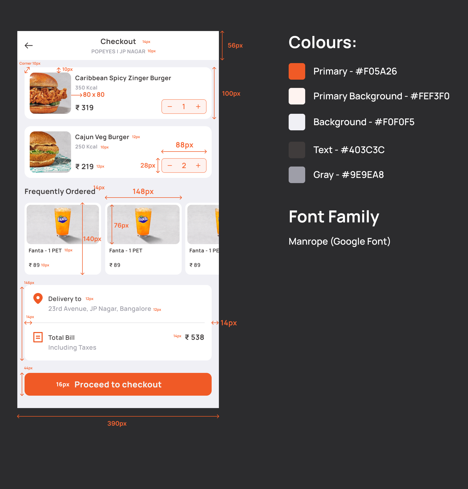

# Swiggy Cart UI

[swiggy-ui-demo.webm](https://github.com/user-attachments/assets/ad9dedd6-c266-4802-b9cd-2d132e4b878f)


### Blue Print



### Tech & Tools

-   React
-   Tailwind
-   TypeScript


### Get it Running

```bash
npm install
```

```bash
npm run dev
```
